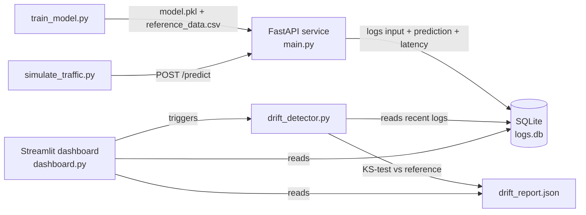

# Live ML Model Health Monitor

A housing-price prediction model deployed as a FastAPI service, with a drift-detection
layer and a live Streamlit dashboard that watch whether incoming data still matches what
the model was trained on. Most student ML projects stop at "I trained a model in a
notebook." This one keeps watching the model after it's live — which is the part that
actually matters in production.

## How it works



1. **`train_model.py`** trains a `RandomForestRegressor` on synthetic housing data and
   saves the model (`model.pkl`) plus the training distribution (`reference_data.csv`).
2. **`main.py`** serves the model behind a `/predict` endpoint and logs every request's
   inputs, prediction, and latency to SQLite (`logs.db`).
3. **`simulate_traffic.py`** sends first "normal" traffic, then deliberately "drifted"
   traffic (a shifted, pricier market), so you can trigger and demo an alert on demand.
4. **`drift_detector.py`** runs a Kolmogorov-Smirnov test per feature, comparing recent
   logged inputs against the training reference, and writes `drift_report.json`.
5. **`dashboard.py`** (Streamlit) shows total predictions, latency, a green/red health
   banner, per-feature drift stats, and overlaid distribution charts.

## Run it locally

```bash
python -m venv venv
source venv/bin/activate          # Windows: venv\Scripts\activate
pip install -r requirements.txt

# 1. Train the baseline model
python train_model.py

# 2. Start the API (leave running in its own terminal)
uvicorn main:app --reload

# 3. In another terminal, send traffic (normal, then drifted)
python simulate_traffic.py --normal 60 --drift 60

# 4. Check for drift
python drift_detector.py

# 5. Launch the dashboard
streamlit run dashboard.py
```

Open `http://localhost:8501` for the dashboard and `http://localhost:8000/docs` for the
interactive API docs (Swagger UI, auto-generated by FastAPI).

## Run it with Docker

```bash
docker compose up --build
```

- API: `http://localhost:8000/docs`
- Dashboard: `http://localhost:8501`

Both containers share the project directory as a volume, so they read and write the same
`logs.db`, `model.pkl`, and `drift_report.json`. This is a demo-friendly setup — a real
production deployment would use object storage for the model and a proper database for
logs instead of a shared file.

## Project structure

```
ml-monitor-pipeline/
├── data_gen.py          # synthetic housing data (normal + drifted distributions)
├── train_model.py        # trains model.pkl, writes reference_data.csv
├── main.py               # FastAPI app: /predict, /health, /stats
├── db.py                 # SQLite helpers shared by the API, detector, and dashboard
├── drift_detector.py     # KS-test drift check, writes drift_report.json
├── simulate_traffic.py   # sends normal + drifted requests to the API
├── dashboard.py           # Streamlit dashboard
├── Dockerfile
├── docker-compose.yml
└── requirements.txt
```

## What this demonstrates

- Deploying a model as a real API, not just running it in a notebook.
- Logging and monitoring production inference (latency, throughput, volume).
- Statistical drift detection (Kolmogorov-Smirnov test) instead of eyeballing charts.
- Containerized, multi-service local deployment via Docker Compose.

## Resume bullet points

**Live ML Model Monitoring Pipeline**

- Deployed a Scikit-learn regression model via a FastAPI service, logging every
  inference's inputs, prediction, and latency to a structured SQLite store.
- Built an automated data drift detector using the Kolmogorov-Smirnov statistical test to
  compare live inference inputs against the training distribution, flagging feature-level
  drift.
- Built an interactive Streamlit dashboard visualizing request volume, p95 inference
  latency, and real-time model health status (healthy / drift detected).
- Containerized the full pipeline (API + dashboard) with Docker Compose for reproducible
  local deployment.

## Suggested next steps (if you want to go further)

- Swap the synthetic dataset for a real one (Kaggle housing/churn dataset) so the numbers
  in your README are grounded in a real problem.
- Add a `/retrain` endpoint or a scheduled job that automatically retrains on drift.
- Add PyTest coverage for `drift_detector.py` and `main.py`, and a GitHub Actions
  workflow that runs them on every push.
- Deploy the API to a free tier (Render, Fly.io, or Cloud Run) and link the live demo
  and Swagger docs from your resume.
